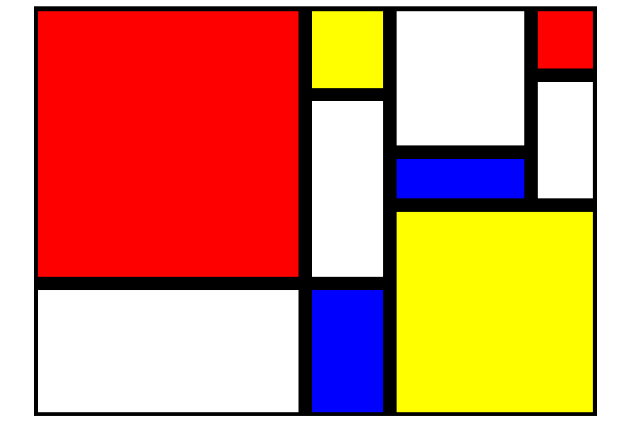

# Create Some CSS Art - A Mondrian Painting

- Using CSS Grid, try to recreate this Mondrian painting.

- Feel free to use different colors

_There are multiple ways to do this, you may need to be specific with your container's width/height as well as your rows/columns width/height_

_Remember you can use a variety of units - px, em, fr, etc... - for the size of rows/columns_

**Image to recreate**:

